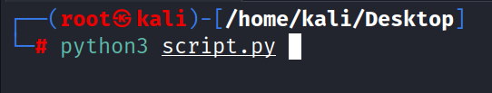

<h1 align="center">
   
    
   
   
    SCRIPT FERNANDO MARTÍNEZ SÁNCHEZ
   
</h1>

# Meli
Script reto mercado libre

## Objetivos

Generar un programa que, a partir de los archivos dados, guarde su contenido en una base de datos y por
cada registro guardado, en donde la clasificación sea alta (high), envíe un email al manager del owner
pidiendo su OK respecto de la clasificación.
Se espera tener una base de datos con la siguiente información almacenada:

            ● nombre de la base de datos
            ● el email del owner
            ● el email del manager
            ● la clasificación de la misma

## Descripción

Se genero el script en el lenguaje de programacion python en su version 3.9, utilizando las siguientes librerias: "PANDAS", "jSON", "SMTPLib", "sqlalchemy" y "psycopg2". Para la creacion de la base de datos se utilizo el sistema de gestion de bases de datos "postgress", para hostear esta base de datos se genero una instancia en la plataforma heroku.

## Ejecución del script desde terminal

    python3 script.py
 

    

 
# Referencias

* [HEROKU]([https://developer.atlassian.com/cloud/jira/platform/rest/v2/intro/#about](https://dashboard.heroku.com/))
* [POSTGRESS]([https://www.jenkins.io/doc/book/using/remote-access-api/](https://www.postgresql.org/))
* [https://www.python.org/](https://support.atlassian.com/jira-software-cloud/docs/smart-values-general/)
